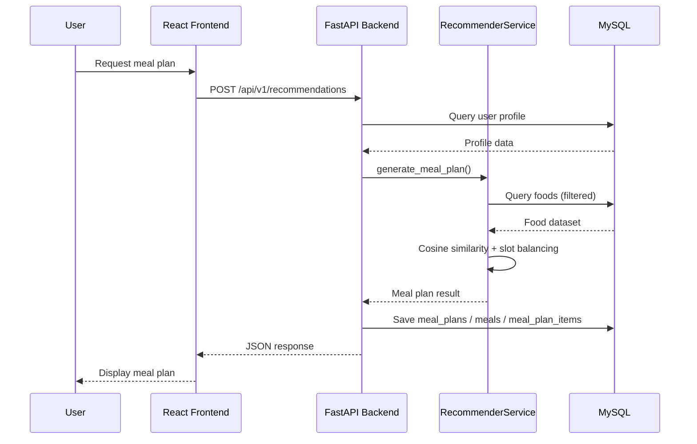
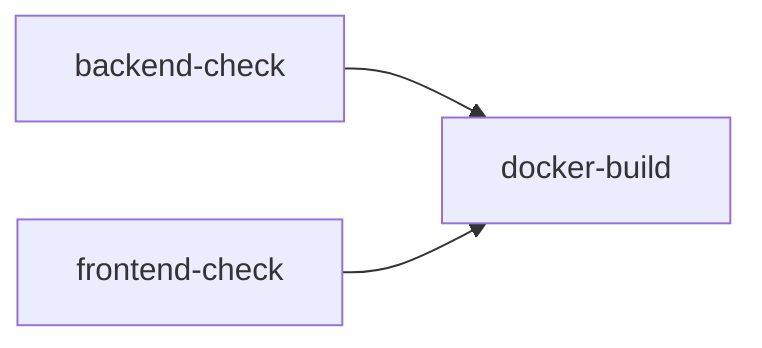

<div align="center">

# 🥗 NutriGain

### *Build Healthy Calories*

A personalized meal plan recommendation system for underweight individuals, combining nutrition science, content-based filtering, and CLIP-powered ingredient recognition.

[](https://fastapi.tiangolo.com/)
[](https://react.dev/)
[](https://www.python.org/)
[](https://www.mysql.com/)
[](https://www.docker.com/)
[](https://github.com/features/actions)

</div>

---

## 📑 Table of Contents

- [Overview](#-overview)
- [Features](#-features)
- [System Architecture](#-system-architecture)
- [Tech Stack](#-tech-stack)
- [Project Structure](#-project-structure)
- [Quick Start](#-quick-start)
- [Main Workflow](#-main-workflow)
- [Recommendation Engine](#-recommendation-engine)
- [Database Overview](#-database-overview)
- [API Overview](#-api-overview)
- [CI/CD](#-cicd)
- [Future Improvements](#-future-improvements)
- [License](#-license)

---

## 🌟 Overview

**NutriGain** is a full-stack web application designed for **underweight individuals (BMI < 23 by Asian standard)** who want to gain weight safely and systematically.

The system calculates personalized calorie and macro targets using the **Mifflin-St Jeor** formula for BMR and TDEE, then generates a 4-meal-per-day meal plan using **content-based filtering with cosine similarity**. Users can recognize available ingredients from a photo using the integrated **OpenAI CLIP** model, track daily consumption, and stay motivated through an **achievement and streak system**.

---

## ✨ Features

### 🤖 Recommendation Engine

- Content-based filtering using **cosine similarity** on nutritional feature vectors
- Per-meal slot role assignment: starch, protein, vegetable, extra
- Calorie and macro balancing per meal and per day
- Anti-repetition across days and within the same meal group
- Mandatory ingredient injection (user-specified ingredients guaranteed to appear)
- Allergy hard-filter and disliked food exclusion
- Budget-tier filtering (low / standard / premium)
- Diet-type support: vegetarian, high-protein, balanced / eat-clean
- Backtracking fallback when candidate pool is too small
- BMI gate: only generates plans for users with BMI < 23 (Asian standard)
- Medical safety ramp: calorie surplus capped at TDEE + 350 kcal for BMI < 16

### 📷 Ingredient Image Recognition

- Upload a photo of fridge contents or raw ingredients
- **OpenAI CLIP** (`clip-vit-base-patch32`) via HuggingFace Transformers + PyTorch
- Per-ingredient prompt groups (bilingual: Vietnamese + English)
- Majority voting across multiple prompt sets for higher accuracy
- Confidence thresholds: High ≥ 0.25, Medium 0.18–0.24
- Filename-based fallback when image confidence is low
- Graceful degradation if PyTorch is not installed

### 📊 Progress Tracking

- Daily weight logging with a **2 kg/day anti-fraud** validation
- Weight history chart with milestone aggregation (3–7 day grouping)
- Calorie and macro consumption statistics (daily / monthly / yearly)
- Food journal: each meal item can be individually marked as eaten
- Nutrition statistics dashboard aggregating `food_log_items` and `meal_consumption_logs`
- PDF export of weight chart and eating history (jsPDF + html2canvas)

### 🎮 Gamification

- **Streak counter**: counts consecutive days with all 3 main meals completed
- **Achievement badges** unlocked automatically on each summary fetch:

| Achievement Key | Condition |
|---|---|
| `first_meal_plan` | Created first meal plan |
| `first_weight_log` | Logged weight for the first time |
| `first_complete_day` | Completed breakfast + lunch + dinner in one day |
| `three_active_days` | Ate on 3 different days |
| `three_balanced_days_in_week` | 3 full-meal days in the current week |
| `discipline_eater` | 7-day consecutive full-meal streak |
| `diverse_menu` | Active eating on 5+ different days |
| `perfect_calories` | Full-meal days on 3+ separate dates |

- Daily challenge system with context-aware prompts
- Gentle, non-shaming encouragement messages

### 🔔 Notifications

- **Email reminders** via SMTP with HTML templates (configurable per-meal time)
- **SMS reminders** via Twilio API
- Background scheduler runs every minute, sends at configured times
- Reminder log stored in `meal_reminder_logs` with sent/failed/skipped status
- Test-send endpoint for both email and SMS

### 👨‍💼 Admin Dashboard

- Overview stats: total users, active users, meal plans, weight logs
- User management: view profiles, meal plans, logs; activate/deactivate accounts
- Food management: full CRUD, exclude/restore from recommendations
- Food category management
- Meal plan viewer and recommendation test tool
- System error log with resolve workflow
- Gamification recalculate trigger

### 🏥 Medical Safety

- Blocks meal plan generation for BMI ≥ 23 (not underweight)
- Warns users when BMI < 16 (severe undernutrition) and caps calorie surplus
- Input validation: weight 20–250 kg, height 100–230 cm, age 1–120
- Rejects weight log updates exceeding 2 kg change per day

### 🔐 Authentication

- Email + password with **bcrypt** hashing
- Email verification flow (OTP code)
- Password reset via email token
- **Google OAuth 2.0** (ID token + server-side callback flows)
- JWT Bearer token authentication (configurable expiry)
- Role-based access control: `USER` / `ADMIN`

---

## 🏗 System Architecture

```
┌─────────────────────────────────────────────┐
│               CLIENT LAYER                  │
│  React 18 SPA — Port 5173                   │
│  Tailwind CSS · Recharts · jsPDF            │
│  React Router · Services Layer              │
└──────────────────┬──────────────────────────┘
                   │ HTTP/REST + JWT Bearer
┌──────────────────┼──────────────────────────┐
│               API LAYER                     │
│  FastAPI (Python 3.11+) — Port 8000         │
│  CORS · JWT Auth · Routes → Services        │
│  CLIP warmup thread on startup              │
└──────────────────┬──────────────────────────┘
                   │ SQLAlchemy ORM (PyMySQL)
┌──────────────────┼──────────────────────────┐
│               DATA LAYER                    │
│  MySQL 8.4 — Port 3307 (host) / 3306 (ctr) │
│  20+ tables · Indexes · Foreign Keys        │
└─────────────────────────────────────────────┘
```



---

## 🛠 Tech Stack

| Layer | Technology |
|---|---|
| **Frontend** | React 18, Tailwind CSS, Recharts, Lucide React |
| **Backend** | FastAPI 0.115.8, Python 3.11+, Uvicorn |
| **Database** | MySQL 8.4 |
| **ORM** | SQLAlchemy 2.0, PyMySQL |
| **AI / ML** | OpenAI CLIP (`clip-vit-base-patch32`), HuggingFace Transformers, PyTorch, scikit-learn, NumPy, Pandas |
| **Auth** | JWT (python-jose), bcrypt, Google OAuth 2.0 |
| **Notifications** | SMTP email, Twilio SMS |
| **PDF Export** | jsPDF, html2canvas |
| **Containerization** | Docker, Docker Compose |
| **CI/CD** | GitHub Actions |

---

## 📁 Project Structure

```
NutriGain/
├── backend/
│   ├── app/
│   │   ├── api/
│   │   │   ├── routes.py          # All REST endpoints (~1500 lines)
│   │   │   ├── dependencies.py    # JWT auth, role guards
│   │   │   └── v1/routes/
│   │   │       └── ai_chat.py     # AI chat sub-router
│   │   ├── controllers/           # Request orchestration
│   │   ├── core/
│   │   │   ├── config.py          # Settings / env vars
│   │   │   ├── database.py        # SQLAlchemy engine + session
│   │   │   └── migrations.py      # Schema migration helpers
│   │   ├── models/
│   │   │   └── entities.py        # SQLAlchemy ORM models
│   │   ├── repositories/          # DB query layer
│   │   ├── scripts/               # CLI: import_foods_csv, process_food_dataset
│   │   ├── services/
│   │   │   ├── recommender_service.py      # Core recommendation logic
│   │   │   ├── clip_ingredient_service.py  # CLIP image recognition
│   │   │   ├── gamification_service.py     # Achievements & streaks
│   │   │   ├── meal_reminder_service.py    # Email/SMS scheduler
│   │   │   ├── auth_service.py             # JWT, Google OAuth
│   │   │   ├── admin_service.py            # Admin operations
│   │   │   ├── nutrition_statistics_service.py
│   │   │   ├── weight_log_service.py
│   │   │   └── food_service.py
│   │   ├── views/
│   │   │   └── schemas.py         # Pydantic request/response schemas
│   │   └── main.py                # FastAPI app, startup/shutdown hooks
│   ├── Dockerfile
│   ├── requirements.txt
│   └── install-clip-cpu.bat       # Windows helper for PyTorch CPU install
│
├── frontend/
│   ├── src/
│   │   ├── views/
│   │   │   ├── DashboardView.jsx  # Main user dashboard
│   │   │   ├── AdminView.jsx      # Admin panel
│   │   │   ├── OnboardingView.jsx # Profile setup wizard
│   │   │   ├── LoginView.jsx
│   │   │   └── HealthEducationView.jsx
│   │   ├── components/            # Reusable UI components
│   │   ├── services/              # API client functions
│   │   ├── controllers/           # View ↔ API logic
│   │   └── utils/                 # Nutrition formatters, validators
│   ├── Dockerfile
│   ├── package.json
│   ├── tailwind.config.cjs
│   └── vite.config.js
│
├── nutrigain_recommender.py       # Standalone recommender core (cosine similarity engine)
├── data/                          # Raw / processed food dataset CSVs
├── docker-compose.yml
├── .env.example
├── .env.local.example
├── .env.docker.example
└── .github/workflows/ci-cd.yml
```

---

## 🚀 Quick Start

### Prerequisites

- Docker Desktop (recommended), **or** Python 3.11+ and Node.js 20+
- MySQL 8.x (if running locally without Docker)

### Option A — Docker (recommended)

```bash
# 1. Copy and configure environment
cp .env.docker.example .env

# 2. Build and start all services
docker compose up --build

# 3. (Optional) run in background
docker compose up -d --build
```

| Service | URL |
|---|---|
| Frontend | http://localhost:5173 |
| Backend API | http://localhost:8000 |
| API Docs (Swagger) | http://localhost:8000/docs |
| MySQL (from host) | `127.0.0.1:3307` |

```bash
# Stop
docker compose down
```

### Option B — Local Development

```powershell
# 1. Copy local env template
Copy-Item .env.local.example .env
```

Edit `.env` with your local MySQL connection:

```env
DATABASE_URL=mysql+pymysql://nutrigain:<password>@127.0.0.1:3306/food_recommender
VITE_API_BASE_URL=http://127.0.0.1:8000
```

```powershell
# 2. Start backend + frontend in separate terminals
.\scripts\dev-local.ps1
```

This opens two terminals:
- **Backend**: activates `.venv-1`, runs `uvicorn` on port 8000
- **Frontend**: runs `npm run dev` on port 5173

#### Installing CLIP / PyTorch (optional — needed for image recognition)

```powershell
# Windows helper script
cd backend
.\install-clip-cpu.bat

# Or manually (CPU-only, lighter)
python -m pip install torch torchvision --index-url https://download.pytorch.org/whl/cpu
```

If PyTorch is not installed, the backend starts normally but returns a graceful error message when the image recognition endpoint is called.

### Key Environment Variables

| Variable | Description |
|---|---|
| `DATABASE_URL` | SQLAlchemy connection string |
| `JWT_SECRET_KEY` | Secret for JWT signing (use `openssl rand -hex 32`) |
| `GOOGLE_CLIENT_ID` / `GOOGLE_CLIENT_SECRET` | Google OAuth 2.0 credentials |
| `SMTP_*` | Email server config for reminders |
| `TWILIO_*` | Twilio SMS credentials |
| `ENABLE_INGREDIENT_IMAGE_RECOGNITION` | `true` / `false` (default: `true`) |

---

## 🔄 Main Workflow

```
User submits profile (weight, height, age, activity level, diet type)
        ↓
System calculates BMI → BMR (Mifflin-St Jeor) → TDEE → Target kcal + macros
        ↓
BMI gate check (blocks BMI ≥ 23; ramps surplus for BMI < 16)
        ↓
Food dataset loaded from MySQL, filtered by allergies / dislikes / budget / diet type
        ↓
Content-based filtering: cosine similarity between user nutrition vector and food vectors
        ↓
Slot assignment: starch + protein + vegetable/fruit + extra per meal (4 meals/day)
        ↓
Mandatory ingredient injection (available ingredients guaranteed to appear)
        ↓
Anti-repetition deduplication across meals and history
        ↓
Meal plan saved: meal_plans → meals → meal_plan_items
        ↓
User marks items eaten → food_log_items + meal_consumption_logs updated
        ↓
Gamification recalculates achievements and streak on each summary fetch
```

---

## 🤖 Recommendation Engine

The core logic lives in `nutrigain_recommender.py` (root) and is orchestrated by `backend/app/services/recommender_service.py`.

### Algorithm Steps

1. Load food records from MySQL into a Pandas DataFrame
2. Apply hard filters: allergies, disliked foods, `excluded_from_recommendation`, `admin_rejected`, budget tier, diet type
3. Build a **nutritional feature vector** for the user's target (kcal, protein, fat, carbs per meal slot)
4. Compute **cosine similarity** between the user vector and each food's scaled feature vector
5. Apply slot-role rules: assign foods to `starch`, `protein`, `vegetable_or_fruit`, `extra` slots
6. Rank candidates by similarity score + calorie proximity + macro balance + diversity jitter
7. Inject mandatory ingredients (user's available ingredients) — replacing lower-ranked slot items if nutritional delta ≤ 250 kcal
8. Apply anti-repetition: penalise foods seen in recent meal history
9. Backtracking fallback: relaxes constraints if the valid pool is too small to fill all slots
10. Persist `MealPlan` → `Meal` → `MealPlanItem` records to the database

### Key Rules

| Rule | Purpose |
|---|---|
| BMI gate (< 23) | Only generates plans for underweight / normal-weight users |
| Medical ramp (BMI < 16) | Caps surplus to TDEE + 350 kcal |
| Allergy hard-filter | Keyword match against food name/category |
| Energy tolerance | Keeps foods within a percentage of the slot's kcal target |
| Macro validation | Detects abnormal macro ratios, optimises protein density |
| Duplicate group check | Limits repeated food groups within and across meals |
| Ingredient coverage | Guarantees user-specified ingredients appear in the plan |
| Image fallback | Uses category SVG placeholder if food has no verified photo |

### CLIP Ingredient Recognition

- Model: `openai/clip-vit-base-patch32` (loaded via HuggingFace `transformers`)
- 27 ingredient classes, each with bilingual prompt groups (Vietnamese + English)
- Majority voting across all prompt-ingredient combinations
- Confidence thresholds: High ≥ 0.25, Medium 0.18–0.24, Low 0.12–0.17
- Per-category strict score gates for meat and seafood to reduce false positives
- Falls back to filename pattern matching when visual confidence is insufficient

---

## 🗄 Database Overview

| Table | Purpose |
|---|---|
| `users` | Accounts, roles, auth provider, email verification status |
| `user_profiles` | Nutrition profile, meal times, reminder settings |
| `foods` | Food dataset: nutrition values, category, image, flags |
| `food_categories` | Food group taxonomy |
| `recommendation_requests` | Each generate/regenerate call with BMR/TDEE snapshot |
| `meal_plans` | One plan per user per day |
| `meals` | 4 meals per plan (breakfast, lunch, dinner, snack) |
| `meal_plan_items` | Individual food items in each meal (system suggestions) |
| `food_logs` | Daily consumption log header per user |
| `food_log_items` | Items user confirmed as eaten |
| `meal_consumption_logs` | Denormalised consumption records for statistics |
| `weight_logs` | Daily weight entries with source tracking |
| `user_achievements` | Unlocked achievement badges |
| `user_daily_activity` | Per-day activity summary for gamification |
| `user_challenges` | Daily challenge completion records |
| `meal_reminder_logs` | Email/SMS reminder send history |
| `user_favorite_foods` | Favourite food preferences |
| `food_ratings` | User ratings per food item |
| `error_logs` | System error records for admin review |

> **Note**: `meal_plan_items` = system suggestions. `food_log_items` = user-confirmed meals eaten.

---

## 📚 API Overview

All endpoints are prefixed with `/api/v1`.

<details>
<summary>Auth</summary>

| Method | Endpoint | Description |
|---|---|---|
| `POST` | `/auth/register` | Register with email + password |
| `POST` | `/auth/verify-email` | Verify email with OTP code |
| `POST` | `/auth/resend-verification` | Resend OTP |
| `POST` | `/auth/login` | Login, returns JWT |
| `POST` | `/auth/google` | Google OAuth (ID token) |
| `GET` | `/auth/google/url` | Get Google OAuth redirect URL |
| `GET` | `/auth/google/callback` | OAuth server-side callback |
| `POST` | `/auth/forgot-password` | Send reset link |
| `POST` | `/auth/reset-password` | Reset with token |

</details>

<details>
<summary>Users & Profile</summary>

| Method | Endpoint | Description |
|---|---|---|
| `GET` | `/users/me` | Get current user |
| `PUT` | `/users/me` | Update user info |
| `PUT` | `/users/me/profile` | Update nutrition profile |

</details>

<details>
<summary>Recommendations & Meal Plans</summary>

| Method | Endpoint | Description |
|---|---|---|
| `POST` | `/recommendations` | Generate new meal plan |
| `GET` | `/recommendations/history` | List recommendation history |
| `GET` | `/recommendations/history/{id}` | History detail |
| `GET` | `/meal-plans/today` | Today's meal plan |
| `POST` | `/meal-plans/regenerate` | Regenerate with available ingredients |
| `POST` | `/meal-plans/restore` | Restore a previous plan |
| `POST` | `/meal-plan-items/{id}/check-in` | Mark item as eaten |
| `POST` | `/meal-consumption/toggle` | Toggle item eaten state |
| `GET` | `/meal-consumption/stats` | Consumption stats (day/month/year) |

</details>

<details>
<summary>Foods & Interactions</summary>

| Method | Endpoint | Description |
|---|---|---|
| `GET` | `/foods` | List foods (with search/filter) |
| `GET` | `/foods/{id}` | Food detail |
| `POST` | `/foods/{id}/favorite` | Add to favourites |
| `DELETE` | `/foods/{id}/favorite` | Remove from favourites |
| `GET` | `/users/me/favorites` | List favourite foods |
| `POST` | `/foods/{id}/rating` | Rate a food |

</details>

<details>
<summary>Image Recognition</summary>

| Method | Endpoint | Description |
|---|---|---|
| `POST` | `/ingredients/recognize-image` | Recognize ingredients from uploaded image |
| `POST` | `/meal-plans/recognize-ingredients` | Legacy image recognition endpoint |

</details>

<details>
<summary>Weight & Statistics</summary>

| Method | Endpoint | Description |
|---|---|---|
| `POST` | `/weight-logs` | Create/update weight log |
| `POST` | `/weight-logs/daily` | Daily weight shortcut |
| `GET` | `/weight-logs` | List logs (milestone/raw mode) |
| `GET` | `/weight-logs/summary` | Weight summary (start/current/change) |
| `GET` | `/nutrition-statistics` | Nutrition stats (today/month/year) |
| `GET` | `/nutrition/eating-history` | Eating history detail |

</details>

<details>
<summary>Gamification</summary>

| Method | Endpoint | Description |
|---|---|---|
| `GET` | `/gamification/summary` | Streak, achievements, daily challenge |
| `POST` | `/gamification/challenges/complete` | Mark challenge complete |
| `POST` | `/gamification/recalculate` | Admin: recalculate all achievements |

</details>

<details>
<summary>Reminders</summary>

| Method | Endpoint | Description |
|---|---|---|
| `POST` | `/meal-reminders/test-email` | Send test reminder email |
| `POST` | `/meal-reminders/test-sms` | Send test reminder SMS |
| `GET` | `/sms/status` | Check SMS/Twilio configuration status |

</details>

<details>
<summary>Admin</summary>

| Method | Endpoint | Description |
|---|---|---|
| `GET` | `/admin/overview` | System overview stats |
| `GET` | `/admin/users` | List users (search, filter by BMI/status) |
| `GET` | `/admin/users/{id}` | User detail |
| `PATCH` | `/admin/users/{id}/status` | Activate/deactivate user |
| `GET/POST/PUT/DELETE` | `/admin/foods` | Food CRUD |
| `POST` | `/admin/foods/{id}/exclude-from-recommendations` | Exclude food |
| `POST` | `/admin/foods/{id}/restore-to-recommendations` | Restore food |
| `GET/POST/PUT/DELETE` | `/admin/categories` | Category CRUD |
| `GET` | `/admin/meal-plans` | List meal plans |
| `POST` | `/admin/recommendation-test` | Test recommendation engine |
| `GET` | `/admin/system-errors` | Error log |
| `PATCH` | `/admin/system-errors/{id}/resolve` | Resolve error |

</details>

---

## 🔄 CI/CD

The project uses a single GitHub Actions workflow (`.github/workflows/ci-cd.yml`) that triggers on every push and pull request to `main`.

### Pipeline Jobs



| Job | What it does |
|---|---|
| **backend-check** | Installs Python 3.11 deps, runs `python -m compileall backend/app` |
| **frontend-check** | Installs Node 20 deps via `npm ci`, runs `npm run build` |
| **docker-build** | Validates `docker compose config`, builds all images |

> The pipeline does **not** include automated deployment to a server. The `docker-build` job verifies that images build correctly and the compose configuration is valid.

### Required GitHub Secrets (for docker-build)

| Secret | Purpose |
|---|---|
| `PEXELS_API_KEY` | Optional — used in backend `.env` during Docker build |

---

## 📈 Future Improvements

- Add password change endpoint for authenticated users
- Expand notification settings (per-meal enable/disable, quiet hours)
- Improve cross-day deduplication to avoid repeating the same food on consecutive days
- Improve food image quality and coverage in the dataset
- Add a dedicated PDF progress report (weight chart + eating history combined)
- Extend gamification with milestone-based weight achievements (e.g. +1 kg, +3 kg)
- Add API rate limiting and request logging middleware
- Separate admin panel into its own route/subdomain

---

## 👥 Contributors

**NutriGain** — Undergraduate thesis project.

---

## 📄 License

This project was developed for academic and thesis purposes. Not licensed for commercial redistribution.
